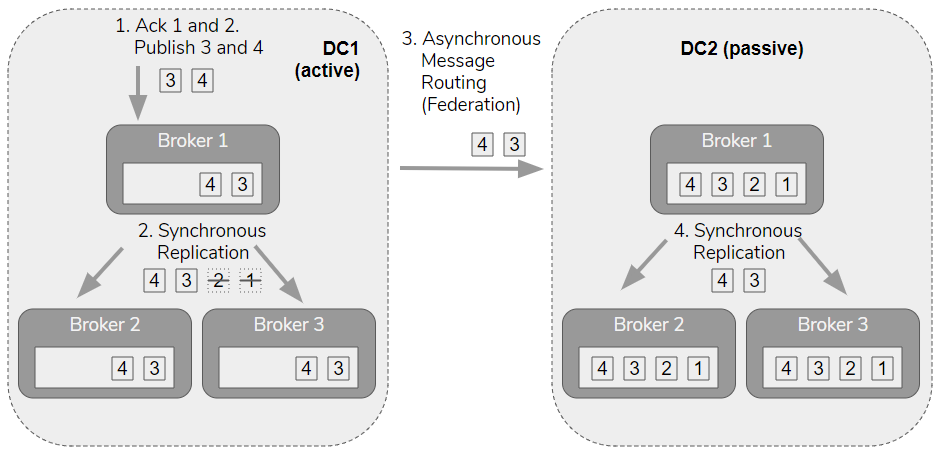

# 이번 주 멘토링 질문 리스트

---
### Rabbit MQ 가 어떻게 동작하는지에 대해서 확실히 공부를 해 보기
- RabbitMQ란?
  - 메세지 브로커로, 메세지를 받아서 forward 해준다. producer(발행자)가 보낸 메시지를 큐(Queue)를 통해 consumer(소비자)에게 전달해 주는 역할을 함.
  - AMQP(Advanced Message Queuing Protocol)를 주로 사용.
    - AMQP 의 전송 흐름:
      - Producer → Connection → Channel → Exchange로 메시지 발행 
      - Exchange는 메시지 속성(routing key, headers 등)과 바인딩된 규칙을 보고 어떤 큐로 보낼지 결정
      - 메시지가 해당 큐에 저장됨
      - Consumer가 큐에서 메시지를 가져가며, 처리 완료 시 ACK(acknowledgement)를 보냄. 처리 실패 시 재전송 또는 DLX(dead-letter exchange)로 보내는 등의 조치 가능
      - 메시지 또는 큐, Exchange 등의 설정은 durable (지속성) 여부, 메시지 persistency 등에 따라 재시작 후에도 잃지 않을 수도 있고 그렇지 않을 수도 있음.
- 메세지 유실에 대해서 RabbitMQ가 가져가는 전략은?
  - RabbitMQ에는 메세지 전달에 대한 2가지 전략이 있다.
    - At-Least-Once(default 전략): 메세지가 중복될 수 있으나, 최소 한번은 반드시 전달
    - At-Most-Once: 메세지가 유실 될 수 있으나, 절대로 중복은 발생하지 않게 전달
  - 이 중 At-Least-Once은 메세지를 큐에 계속 가지고 있다가, 컨수머에서 수신 후 ACK를 보내면 그 떄 큐에서 삭제하는 것으로 메세지의 도착을 보장함.
    - 만일 ACK를 받기 이전에 컨수머가 crash된다면 다시 큐에 넣어서 대기 시킴.
- 클라우드 환경에서, 하나의 RabbitMQ 인스턴스가 죽었을 때, 어떻게 다른 인스턴스가 메세지의 누락을 방지하는지?
  ```
  RabbitMQ는:
  - clustering of multiple nodes
  - synchronous replication - replicated queues
  - asynchronous cluster-to-cluster message routing - exchange federation and shovels
  - limited back-up support
  - limited rack awareness support
  을 제공한다.
  ```
  - 
    - 클러스터링 환경에서 RabbitMQ는 위 사진 처럼 active-passive 모델로 데이터를 복제하는 로직을 사용함.
    - Mirror Queues (HA Queue, 그림의 broker 2,3) 와 Quorum Queues (그림의 broker 1) 를 통해 복제 큐를 제공하고, 이 큐들은 동기적 복제 (synchronous replication)를 통해 HA 를 제공함.
      - 이후, 데아터 센터간에 비동기적으로 DC1에 들어온 exchange에 해당하는 메세지를 패시브 데이터센터인 DC2 에 전달한 후 보관함.
      - 허나 이 방식은 한계가 존재하는데, 그림 처럼 메세지 1,2 번이 활성화 (active) 데이터 센터에서는 컨수머에 의해 소비 될 수 있으나, 이 소비되는 과정이 DC2에는 적용되지 않음.
        - 그렇기에 DC2에 있는 메세지들은, TTL을 통해 시간 베이스로 삭제 하거나, 큐의 길이 제한을 둬 특정 갯수까지만 저장하는 방식으로 처리할 수 있다고 한다.
          - 그러나 이러한 방식으로는 완벽한 HA를 보장할 수는 없다
          - 만일 1시간을 TTL로 잡았다고 가정했을때, active DC에 1시간이 지나도 소비되지 않는 경우가 생긴다면, DC1 이 다운되었을 때 백업으로 DC2에 붙었을 때 해당 메세지는 TTL이 지나 이미 삭제처되어 제대로 동작하지 못하는 이슈가 있을 수 있다.
        - 이러한 상황을 극복할 수 있는 방법은 중복을 용인하는 (duplicate tolerate) 시스템을 구축하여 중복이 발생하더라도 무시하고 넘어 갈 수 있게 만들면 좋다고 한다.
    
  - 참조: [**RabbitMQ에서 어떻게 HA(High Availability)와 DR(Disaster Recovery)를 supports 하는지 설명해 주는 RabbitMQ의 블로그**](https://www.rabbitmq.com/blog/2020/07/07/disaster-recovery-and-high-availability-101?utm_source=chatgpt.com)
    - HA 와 DR 에 대해서 부터 설명해줌
