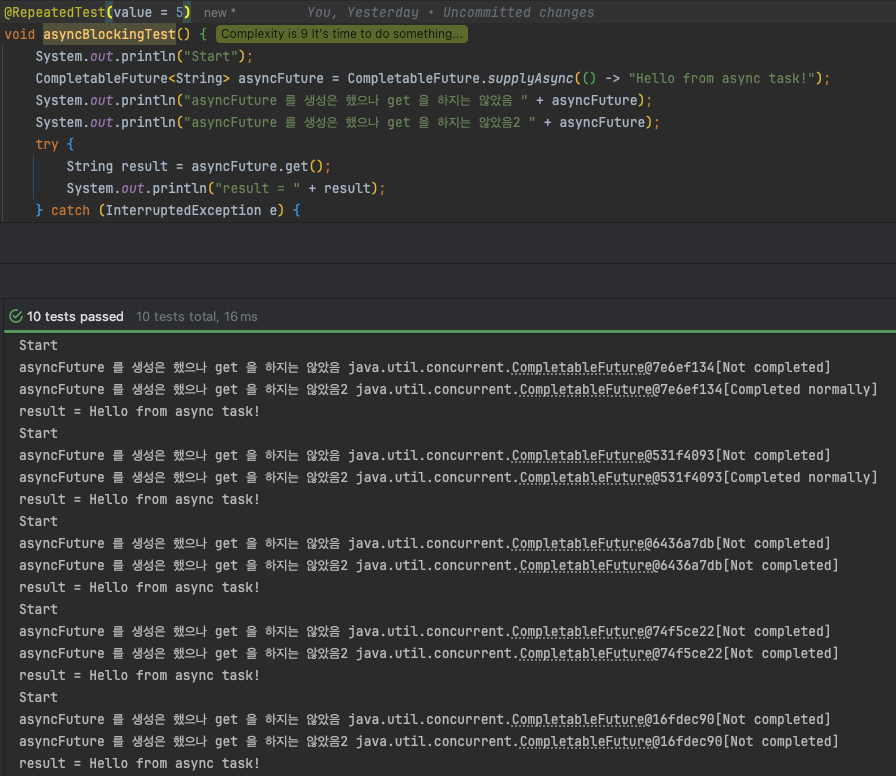
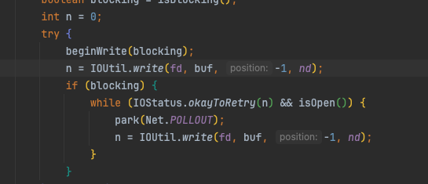

#### 함수 관점에서 blocking non-blocking & sync async:

- blocking:
    - 호출한 함수에게 제어권을 주지 않고, 자신의 작업을 완료할 때까지 호출한 함수를 기다리게 함.
- non-blocking:
    - 호출한 함수에게 제어권을 즉시 반환하여, 호출한 함수가 다른 작업을 수행할 수 있도록 함.
- sync:
    - 작업이 순차적으로 실행됨. 하나의 작업이 완료된 후에야 다음 작업이 시작됨.
- async:
    - 작업이 병렬적으로 실행될 수 있음. 하나의 작업이 완료되기를 기다리지 않고, 다른 작업을 동시에 수행할 수 있음.

- 조합별 예시:
    - async & non-blocking:
        - LiveKit Java/Kotlin Server SDK에서 LiveKit 서버로 요청을 보낼 때 사용하는 라이브러리인 retrofit2.Call 인터페이스의 enqueue 메서드는 비동기 + 논블로킹 방식으로 동작함.
          -> 매개변수로 Callback 객체를 전달하여 요청이 완료되었을 때 호출될 콜백 메서드를 정의함. enqueue 메서드는 즉시 반환되며, 네트워크 요청이 백그라운드에서 처리되는 동안 호출한 스레드는 다른 작업을 계속 수행할 수 있음
    - async & blocking:
        - Java의 CompletableFuture.get() 메서드는 비동기 + 블로킹 방식으로 동작함.
          -> Future 객체는 비동기 작업의 결과를 나타내며, get() 메서드를 호출하면 해당 작업이 완료될 때까지 현재 스레드를 블로킹함. 작업이 완료되면 결과를 반환함.
        - 
            - 5번의 실행중, 2번은 이미 비동기 작업이 종료되지 않았으나 get() 을 호출하면 내부에서 waitingGet() 을 호출하여 블로킹이 발생함. 그렇기 때문에 NotCompleted 상태가 있었더라도 모든 테스트 케이스에서 완료될 때까지
              대기한 후 결과를 반환함.
    - sync & blocking:
        - 대부분의 전통적인 함수 호출이 동기 + 블로킹 방식으로 동작함.
          -> 예를 들어, 파일 읽기 작업을 수행하는 함수는 파일을 완전히 읽을 때까지 호출한 스레드를 블로킹함. 작업이 완료되면 결과를 반환함.
    - sync & non-blocking:
        - NIO의 SocketChannel의 read(), write() 함수들은, 내부의 로직을 보면 객체 생성시 설정한 값(`socketChannel.configureBlocking(false);`)에 따라, 읽기와 쓰기 동작을
          blocking/non-blocking 하게 동작하도록 구성하였다.
            - 
        - non-blocking 한 경우, 실제 io 작업은 끝나지 않았고 channel은 아직 열려있는 상태이나 즉각적으로 만든 n 을 리턴한다.

### HTTP 관련

- Http 에서 cache란?
    - 클라이언트, 중간 매계(프록시, CDN, etc), 서버에서 HTTP 응답의 사본을 저장하게 해주는 메커니즘이고, 서버 부담을 줄이기 위해 활용됨.
    - 캐시가 저장되는 장소?
        - 브라우저 자체 캐시
        - 프록시 서버 캐시 => ex: Nginx reverse proxy
        - 서버 캐시 => ex: microservice caching responses before forwarding
    - Cache는 리스폰스 헤더에서 조절이 가능하며, 주요 헤더는 아래와 같음
        - Cache-Control: 캐시 동작을 제어하는 지시어를 포함함 (ex: max-age, no-cache, no-store, public/private 등)
        - Etag: 리소스의 특정 버전을 식별하는 고유한 식별자
        - Last-Modified: 리소스가 마지막으로 수정된 날짜와 시간을 나타냄
    - 캐싱 동작
        - max-age 내에서는 캐시된 응답을 재사용할 수 있음.
            - 하지만 ETag 또는 Last-Modified가 있으면 브라우저가 조기 재검증을 시도할 수도 있음 (특히 HTTPS).
        - no-cache는 "캐시 저장은 가능하되, 사용할 때는 반드시 서버에 확인".
            - 캐시 저장 방지는 no-store.
    - 어떠한 경우에 이런 캐시 정책이 활용되기 좋을까?
        - 응답이 스태틱한 경우에 사용할 수 있을 것 같다. ex: 동적으로 변경이 되는 파비콘 정보, css, js 등 변경이 가능은 하지만 자주 변경되지 않는 리소스들
        - Etag / Last-Modified 를 통해 실제 응답의 변화가 없다면 304를 빠르게 리턴하는게 캐시 사용의 이점이니만큼, 서비스 로직에서 사용하게 된다면 레디스 등에 etag / updated_at 등을 저장한 후 요청이 왔을 때 레디스에서
          If-None-Match / Last-Modified 등과 비교해서 사용하는 것도 좋을 것 같다.

- HTTP가 cache를 활용하는 방식?
    - 캐시를 저장하는 경우:
        - 요청이 GET/HEAD 인 경우
        - 응답 헤더에 Cache-Control 이 존재하고, Cache-control에 max-age, s-maxage, public 등의 캐시 가능 지시어가 포함된 경우
            - 응답 상태가 RFC 7234에 정의된 캐시 가능 상태(200, 203, 204, 206, 300, 301, 404, 410 등) 인 경우에만 캐시를 저장함.
        - Etag, Last-Modified 헤더가 있는 경우, 캐시에 저장한 후 클라이언트는 캐시된 응답을 사용할 때 서버에 재검증 요청을 보낼 수 있음.
    - 캐시를 저장하지 않는 경우:
        - 요청이 GET/HEAD 외의 다른 메서드
        - 응답 헤더에 Cache-Control 헤더에 아래 항목이 포함된 경우:
            - no-store -> 캐시 저장 금지
            - private -> 공유 프록시는 캐시 금지, 브라우저 캐시는 가능
            - no-cache -> 캐시 저장은 가능하나, 사용할 때 반드시 서버에 확인
        - 응답의 상태 코드가 500, 502, 503, 504 등 서버 오류 상태 코드인 경우
- Content-Type Header 는 무엇일까?
    - HTTP에서 전송되는 본문(Body)의 타입과 형식을 나타내는 헤더.
        - 본문(payload)이 어떤 MIME 타입(Media Type)을 가지는지 명시
    - 텍스트 기반
        - text/html → HTML 문서
        - text/plain → 일반 텍스트
        - text/css → CSS 스타일시트
        - text/javascript (혹은 application/javascript) → JS 코드
    - JSON / XML
        - application/json → JSON 데이터
        - application/xml → XML 데이터
    - 파일 업로드/다운로드
        - multipart/form-data → 파일 업로드 시 (폼 기반)
        - application/octet-stream → 이진 데이터(다운로드 용도)
    - 이미지
        - image/png, image/jpeg, image/gif 등

- Accept 는 어떤 헤더인가?
    - HTTP Request 헤더 중 하나로 클라이언트(브라우저, 앱 등)가 서버에게 “나는 이런 타입의 응답을 받아들일 수 있어” 라고 알리는 용도
        - 서버가 여러 포맷(JSON, XML, HTML 등) 중 무엇을 돌려줄지 선택할 때 참고하는 콘텐츠
          협상([Content Negotiation](https://developer.mozilla.org/en-US/docs/Web/HTTP/Guides/Content_negotiation#principles_of_content_negotiation))의
          핵심 헤더
    - 같은 URL을 사용하더라도, 이 헤더를 통해 클라이언트가 원하는 응답 타입을 지정할 수 있음
        - ex: 브라우저는 HTML, API 클라이언트는 JSON
    - 하나만이 아니라 여러개를 지정할 수 있으며, 선호도를 지정해 원하는 순서를 나타낼 수도 있음
        - ex: `Accept: text/html, application/xhtml+xml, application/xml;q=0.9`
    - 만일 서버에 클라이언트가 요청한 타입을 제공할 수 없다면, 서버는 406 Not Acceptable 상태 코드를 반환

- Session 과 Cookie 의 관계
    - 세션은 서버가 유지하는 사용자의 상태 정보.
        - 이 세션은 보통 특정할 수 있는 고유한 세션 ID를 가짐.
        - 서버는 이 세션 ID를 통해 사용자의 상태 정보를 조회하고 관리함.
    - 쿠키는 클라이언트가 저장하는 데이터의 조각
        - 이 안에 세션 ID를 담아 서버와의 통신 시 함께 전송함.
    - 멘토링에서 나왔던 내용들:
        - 쿠키가 좋아요 세션이 좋아요 이렇게 물어보는 것 자체가 함정인 게 누가 더 좋은게 아님.
        - 세션을 담아서 쓰면 되는 거고 그리고 여기서 안 좋다라고 하는 건 쿠키의 모든 사용자 정보를 담아서 인증에다 활용하는 것이 문제가 되는 것.
        - 세션을 세션 스토리지에 쿠키에 담아서 매 요청마다 스토리지를 왔다 갔다 하면서 헤더에 담아 보내는 방법도 있고, 이게 그렇게 나쁘다 할 수 있는지 모르겠다.
- Jwt vs Session 방식 
  - 세션 = "서버가 기억하고, 클라이언트는 열쇠만 들고 다님"
    - stateful 하게 서버가 세션의 데이터를 계속해서 물고있어야 함
  - JWT = "서버는 안 기억하고, 클라이언트가 자기 증명서를 항상 들고 다님"
    - 서버에서는 별다른 데이터를 들고 있지 않고, 클라이언트에서 넘겨주는 토큰에 의존해서 인증을함.
    - 서버에서 상태를 관리하지 않기에 발생할 수 있는 문제점:
      - 토큰의 만료 전까지 강제 무효화 시키기가 어려움
        - 이는 일반적인 경우에는 엑세스 토큰을 굉장히 짧은 주기로 생성하고 (5~15분) 리프레시 토큰을 길게 만들어서 (1주일 ~ 1달) 액션이 있을 때 토큰 재발급 로직을 추가하고 (필터 등으로) 리프레시 토큰을 서버에 DB 등에 저장한 후 로그아웃 시나리오가 발생하면 삭제시키는 방법. -> 이후 엑세스 토큰이 만료되어 버리면 리프레시 토큰을 통해 재발급이 불가해 지면서 로그아웃 될 것임.
        - Blacklisting -> 리프레시 토큰과 비슷하게 엑세스 토큰을 DB/Redis 등에 저장해 두었다가, 서버에서 이벤트가 발생하면 무호화된 리스트에 추가해버려서 요청이 오면 블락해버리는 방법
          - 다만 이 방법은 사실상 세션과 다를게 없음
      - 쿠키/로컬스토리지/세션스토리지에 있는 토큰이 복사되어 사용되는 경우에도 문제가 될 수 있을 것 같은데 이는 어떻게 방지할 수 있을까?
        - 쿠키 자체에 보안 설정을 걸 수 있음
          - http-only -> 자바스크립트에서 쿠키가 접근 할 수 없게 하는 옵션 (XSS 방지)
          - Secure -> HTTPS 연결시에만 전송 -> 네트워크 패킷 탈취 방지
          - SameSite -> 크로스 사이트 요청 제한 (CSRF 방지)
        - 위 옵션을 모두 적용한 쿠키가 가장 안전한 방식이라고 생각이 됨 (브라우져의 경우)