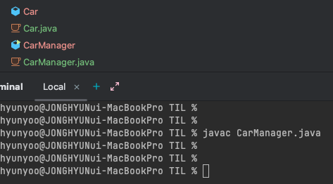

## Ch.02 Hello God of Java
- 제어자 (modifier): public static 과 같이 메서드의 특성을 정하는 부분  
- `직접해 봅시다`  
  ```java 
    public class Profile {
        public static void main(String[] args){
            System.out.println("My Name is JH Yoo");
            System.out.println("My Age is 31");
        }
    }
    ```
- `정리해 봅시다`
  - public, static, void
  - 문자열 배열 (String[])
  - 아니오
  - 문자열을 출력하고 줄바꿈을 하는데 사용됨.
  - print()는 출력만하고, println()은 출력 후 줄을 바꿈
  - 한 줄 주석
  - 블록 주석 처리되어 해당 블록 내의 모든 내용은 무시된다
  - 리턴 타입, 메소드 이름, 메소드 내용

## Ch.03 자바가 무엇인지 알려면 객체가 무엇인지 알아야해요
- 69 페이지의 내용중, CarManager 만 컴파일 했는데, Car 까지 같이 컴파일이 되었다. 무엇이 이러한 동작을 하게 만들고 어떻게 가능한 것인가?  
  - 자바의 컴파일 과정을 살펴보면, javac (Java Compiler)가 소스 코드를 class 파일로 변환한 후, jvm에 해당 코드가 올라가게 되면 JVM 의 class loader 에게 바이트 코드가 전달되고, 이 class loader 가 해당 클래스를 올리기 위한 클래스들을 로딩 및 링크하여 런타임 데이터 영역 (JVM의 메모리) 에 올라가게 된다. 그렇기에 직접적으로 컴파일하지 않았어도 동적으로 해당 클래스또한 컴파일된다.
  - 
    - javac CarManager로 CarManager만 컴파일 했으나, Car 까지 컴파일되는 것을 확인할 수 있음.
- `직접해 봅시다`
  ```java 
    public class Profile {
        String name;
        int age;
  
        public static void main(String[] args){
            int age = 31;
            String name = "JH Yoo";
            System.out.println("My Name is "+name);
            System.out.println("My Age is "+age);
			    
            Profile profile = new Profile();
            profile.setName("Min");
            profile.setAge(20);
        }
        public void setName(String str) {name = str;}
  
        public void setAge(int val) {  age = val; }
  
        public void printName() {
            System.out.println("My name is " + name);
        }
  
        public void printAge() {
            System.out.println("My age is " + age);
        }
    }
    ```
- `정리해 봅시다`
  - 클래스와 객체의 차이점을 말해 주세요. 
    - 답: 클래스는 정의이고, 객체를 그 정의를 바탕으로 생성된 대상
    - 정답: 클래스를 통해서 객체를 생성할 수 있다. 즉, 하나의 클래스를 만들면 그 클래스의 모습을 갖는 여러 객체들을 생성 할 수 있다. 그러므로, 일반적인 경우 클래스의 메소드나 변수들을 사용하려면 객체를 생성하여 사용하여야 한다
  - 객체를 생성하기 위해서 꼭 사용해야 하는 예약어는 뭐라고 했죠? 
    - new
  - 객체를 생성하기 위해서 사용하는 메소드 같이 생긴 클래스 이름에 소괄호가 있는 것을 뭐라고 하나요?
    - 이 질문의 의미가, 생성자는 메소드가 아니라고 하는 것인가?
    - 생성자
  - 객체의 메소드를 사용하려면 어떤 기호를 객체이름과 메소드 이름 사이에 넣어주어야 하나요?
    - . 
  - 여러분들이 메소드를 사용하기 위해서는 어떤 것을 만들어야 하나요?
    - 클래스의 객체
  - 위의 문제에서 만들어야 하는 것은 어떤 예약어를 사용하고, 클래스의 무엇을 사용해야 하나요?
    - new 예약어와 클래스의 생성자를 이용해 객체를 생성.