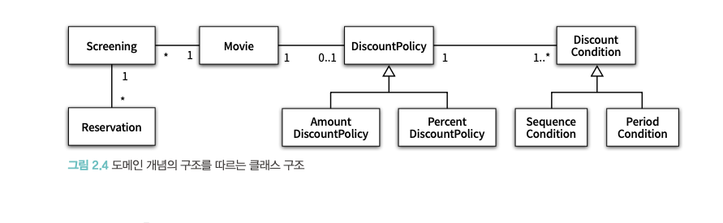
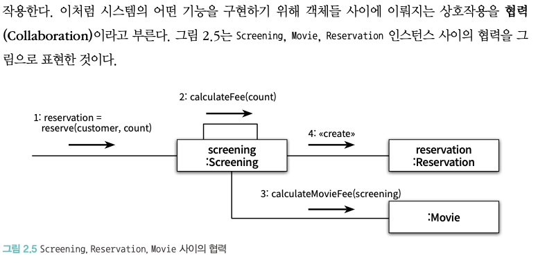

# 2장 객체지향 프로그래밍
- 이번 장의 목표는 다양한 책의 주제들을 얕은 수준으로 가볍게 살펴보는 것

### 01 영화 예매 시스템 
#### 요구사항 살펴보기
- 용어의 구분
  - `영화(Movie)`: 영화에 대한 기본 정보
    - 제목, 상영시간, 가격 정보 등 **영화가 가지고 있는 기본적인 정보**
  - `상영(Screening)`: 실제로 관객들이 영화를 관람하는 사건
    - 상영 일자, 시간, 순번 등
  - 두 용어를 구분하는 이유는 사용자가 실제로 예매하는 대상은 영화가 아니라 상영이기 때문
  - 할인액을 결정하는 규칙:
    - `할인 조건 (DiscountCondition)`
      - 가격의 할인 여부를 결정
        - `순서 조건 (SequenceCondition)` 상영 순번을 이용해 할인 여부를 결정하는 규칙
          - ex) 매일 10번째로 상영되는 영화를 예매한 사용자들에게 할인 혜택 제공
        - `기간 조건 (PeriodCondition)` 영화 상영 시작 시간을 이용해 할인 여부를 경정
          - 요일, 시작 시간, 종료 시간 세 부분으로 구성.
          - ex) 조조 할인, 요일 할인 등
    - `할인 정책 (DiscountPolicy)`
      - 할인 요금을 결정.
        - `금액 할인 정책 (AmountDiscountPolicy)`
        - `비율 할인 정책 (PercentDiscountPolicy)`
        - 영화별로 하나의 할인 정책만 할당이 가능 (정책을 지정하지 않는 것도 가능)
### 02 객체지향 프로그래밍을 향해
#### 협렵, 객체, 클래스
- 객체지향 패러다임으로 전환하려면 클래스가 아닌 객체에 초점을 맞춰야함
- 이를 위해 필요한 사항들:
  1. 어떤 클래스가 필요한지 고민하기 전에, 어떤 객체가 필요한지 고민하라.
     - 클래스는 공통적인 상태와 행동을 공유하는 객체들을 추상화한 것. 
     - 클래스의 윤곽을 잡기 위해선 어떤 객체들이 어떤 상태와 행동을 가지는 지를 먼저 결정해야함.
     - 객체를 중심에 두는 접근 방법은 설계를 단순하고 깔끔하게 만들어 줌.
  2. 객체를 독립적 존재가 아니라 기능을 구현하기 위해 협렵하는 공동체의 일원으로 봐야한다
     - 설계를 할때, 객체를 고립된 존재로 바라보지 말고 협렵에 참여하는 협력자로 바라봐야함
     - 훌륭한 협렵을 할 수 있는 설계를 하면, 훌륭한 객체를 만들 수 있고, 훌륭한 객체는 흘륭한 클래스가 된다

#### 도메인의 구조를 따르는 프로그램 구조
- 소프트웨어는 사용자가 원하는 어떤 문제를 해결하기 위해 만들어지고, 이러한 **문제를 해결하기 위해 사용자가 프로그램을 사용하는 분야를 도메인이라 함**
- 객체지향 패러다임이 강력한 이유는 요구사항 분석 초기 단계부터 프로그램 구현 마지막까지 객체라는 동일한 추상화 기법을 사용할 수 있기 때문.
  - 요구사항과 프로그램을 객체라는 동일한 관점에서 바라볼 수 있기 때문에 도메인을 구성하는 개념들이 프로그램의 객체와 클래스로 매끄럽게 연결됨
- 이 시점에 객체들을 이용해, 구조도를 만든 이후 클래스의 구현을 하는게 저자가 말하는 방식
  - 

#### 클래스 구현하기
- Screening
  - Movie, 순번(sequence), 상영 시작 시간 (whenScreened) 를 인스턴스 변수로 가짐
  - whenScreenced을 반환하는 getStartTime, 순번의 일치여부를 검사하는 isSequence, 기본 요금을 반환하는 getMovieFee 
    - ```java
        public class Screening {
            private Movie movie;
            private int sequence;
            private LocalDateTime whenScreened;
            public Screening (Movie movie, int sequence, LocalDateTime whenScreened) {
                this.movie = movie;
                this. sequence = sequence;
                this. whenScreened = whenScreened;
            }
            public LocalDateTime getStartTime() {
                return whenScreened;
            }
            public boolean isSequence(int sequence) {
                return this. sequence == sequence;
            }
            public Money getMovieFee() {
                return movie.getFee();
            }
        }
      ```
  - 주목할 점: 인스턴스 변수는 private, 메서드의 가시성은 public
    - 클래스 구현시 가장 중요한 것: 클래스의 경계를 구분 짓는 것
      - 어떤 부분을 외부에 공개하고 어떤 부분을 감출 지를 결정해야함
      - 이 클래스에서는 객체의 속성에 직접 접근할 수 없도록 막고, 적절한 public 메서드를 통해서만 내부 상태를 변경할 수 있게 해야함
      - **왜 내부와 외부의 구분이 필요한가?**
        - **_경계의 명확성이 객체의 자율성을 보장한다_**
        - _**프로그래머에세 구현의 자유를 보장한다**_
##### 자율적인 객체
중요한 두가지 사실:
1. 객체는 상태(state) 와 행동(behavior)를 함께 가지는 복합적인 존재
2. 객체는 스스로 판단하고 행동하는 자율적인 존재  

- 캡슐화: 객체라는 단위 안에 데이터와 기능을 한 덩이리로 묶음으로써 문제 영역의 아이디어를 적절하게 표현할 수 있게 하는 것
- 대부분의 객체지향 언어들은 캡슐화에서 더 나아가 외부에서의 **접근을 통제할 수 있는 접근 제어 메커니즘을 제공**
  - 자바의 access modifier (public, protected, private, etc)
- 객체들의 자율적인 공동체를 만들려먼, 각 객체가 독립적이고 자율적이여야한다. 그렇기에 객체 내부에서 외부의 간섭을 최소화 해야함
  - 객체는 다른 객체에게 원하는 것을 요청하고, 요청받는 객체가 스스로 최선의 방법을 결정할 수 있을 것이라는 점을 믿고 기다려야한다.

캡슐화와 접근 제어는 객체를 두 부분으로 나눔:
1. `퍼블릭 인터페이스 (public interface)`: 외부에서 접근 가능한 부분
2. `구현 (implementaion)`: 외부에서 접근 불가능하고 오직 내부에서만 접근 가능한 부분

-> 일반적으로는 객체의 상태는 숨기고 행동만 공개해야 한다.

##### 프로그래머의 자유
- 프로그래머는 두 종류로 구분 가능
  - 클래스 작성자 (class creator):
    - 새로운 데이터 타입을 프로그램에 추가
  - 클라이언트 프로그래머 (client programmer)
    - 클래스 작성자가 추가한 데이터 타입을 사용
- 구현 은닉 (implementation hiding): 클래스 작성자가 클라이언트 프로그래머에게 필요한 부분만 공개하고 나머지를 숨겨 마음대로 접근할 수 없도록 방지해 클라이언트 프로그래머에 대한 영향을 걱정하지 않고도 내부 구현을 마음대로 변경 할 수 있게 하는 행위.
  - 접근 제어 메커니즘을 통해 이를 구현함.
  - 구현은닉은 클라이언트 프로그래머에게도 유용하다. 모든 코드를 완벽히 알 필요 없이 필요한 부분만 공개되기 떄문.

#### 협력하는 객체들의 공동체
- 객체지향의 장점은 객체를 이용해 도메인의 의미를 풍부하게 표현할 수 있다는 것
  - 의미를 좀 더 명시적이고 분명하게 표현할 수 있다면 객체를 사용해서 해당 개념을 구현 하라. 
    - 비록 하나의 인스턴스 변수만 포함하더라도 개념을 명시적으로 표현하는 것은 전체적인 설계의 명확성과 유연성을 높인다.
  - 

#### 협력에 관한 짧은 이야기
- 객체는 다른 객체의 인터페이스에 공개된 행동을 수행하도록 요청할 수 있다.
- 요청을 받은 객체는 자율적인 방법에 따라 요청을 처리한 후 응답한다.
- 객체가 다른 객체와 상호 작용하는 유일한 방법: 메세지를 전송 (send a message)
  - 수신한 객체 입장에서 메시지를 처리하는 자신만의 방법을 메서드(method)라고 부른다.
- 메시지와 메서드의 차이?
  - 책의 예제의 내용중 (아래 예제), Screening 이 Movie의 calculateMovieFee 메서드를 호출한 것이 아니라, Screening 이 인스턴스 변수인 Movie 에 calculateMovieFee 라는 메시지를 전송했다는게 맞는 표현.
    ```java
        public class Screening {
            ~~~
            private Money calculateFee(int audienceCount) {
                return movie.calculateMovieFee(this).times(audienceCount);
            }
        }
    ```
### 03 할인 요금 구하기
#### 할인 요금 계산을 위한 협력 시작하기
- Template Method 패턴: 부모 클래스 (추상클래스, 인터페이스 등)에 기본적인 알고리즘의 흐름을 구현하고 중간에 필요한 처리를 자식 클래스에게 위임하는 디자인 패턴

#### 할인 정책 구성하기
