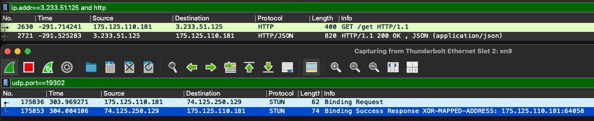

1. (WebRTC 관련) HTTP 와 STUN 은 어떻게 다른 프로토콜인가?
   - 
   - 사진의 위는 httpbin.org 사이트를 통해 get 요청을 시도했을때의 패킷이고, 아래는 stunclient 를 통해 구글의 스턴서버 (stun:stun.l.google.com:19302) 로 스턴 바인딩 리퀘스트를 보냈을 때의 wireshark 를 이용한 캡처이다.
   - wireshark 를 이용항 패킷상으로는, 두 프로토콜 모두 요청을 보내는 패킷이 하나, 응답을 받는 패킷이 하나 존재한다.
   - 가장 큰 차이점으로는 http 는 tcp 로 전송되는 프로토콜이고, stun 은 udp (일반적으로는) 로 전송되는 프로토콜이다.
     - 이는 두 프로토콜이 사용되는 목적이 다르기에 다른 프로토콜을 사용했다 판단된다. stun 의 경우 NAT 환경이 P2P 연결 보조를 위해 사용되는 프로토콜이고 HTTP는 리소스의 전달을 위해 사용되는 프로토콜.
     - 리소스의 전달은 반드시 보장이 되어야 하는 반면, NAT 환경에서의 데이터 전송이 주된 사용목적이기에 전달에 더 주로 사용되는 UDP 가 일반적으로 사용되는 듯 하다.
       - 다만 reliability 가 보장이 되어야 하는 경우에는 stun 도 TCP 혹은 TLS-over-TCP 로도 전송이 가능하다 ([RFC5389](https://www.rfc-editor.org/rfc/rfc5389#section-7.2.2))
   - 메세지를 보내는 형식이 다르다. 
     - http 는 HyperText Transfer Protocol 인 만큼 메세지를 텍스트 기반의 메세지 형식을 전달함
     - stun 의 경우 바이너리로 전달함 (이 때문에 wireshark 등의 툴이 강제됨)
   - 요청과 응답을 기록하는 방식:
     - Stun 은 [RFC5389](https://datatracker.ietf.org/doc/html/rfc5389#section-7.2.1) 은 기본적으로 binding request <-> binding response 를 주고 받는데 이 과정은 완전히 무상태이며, TCP 와는 달리 sequence number 나 handshaking 프로세스가 없어 요청과 응답을 연관시키기 위한 값이 필요하고 이 transaction ID 가 그 역할을 함 ([RFC8489](https://datatracker.ietf.org/doc/html/rfc8489#section-2))
